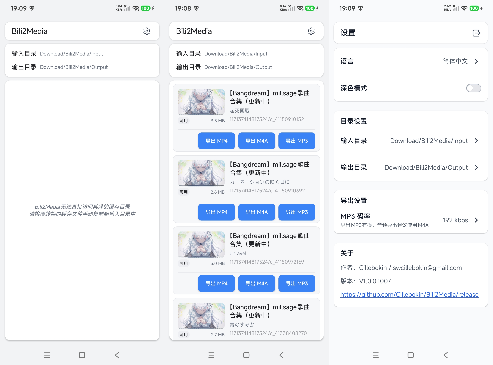

[简体中文](README.md) | [English](README.en.md)

# Bili2Media

Bili2Media is an Android app for exporting cached media from Bi****li as MP4, M4A, or MP3.

Works offline. **No ads.**

**If you use the app and have a feature request or run into an issue, please send your feedback to the author.**

Download the APK:

[Download](https://github.com/Cillebokin/Bili2Media/releases)

## Usage

- Default input directory: `Download/Bili2Media/Input`
- Default output directory: `Download/Bili2Media/Output`
- Choose MP4, M4A, or MP3 on the main screen. Settings lets you change the input/output directories and MP3 bitrate.

> Bili2Media cannot access Bi****li's cache directory directly. Manually copy the cache files you want to convert to the input directory, or choose another accessible directory in Settings.

## Screenshots



## Requirements

- Android 13 or later
- The **All files access** permission must be granted

## Release Notes

For detailed release notes, see:

```text
版本说明.txt
```

## Author

Cillebokin / swcillebokin@gmail.com

Project page:

```text
https://github.com/Cillebokin/Bili2Media
```
